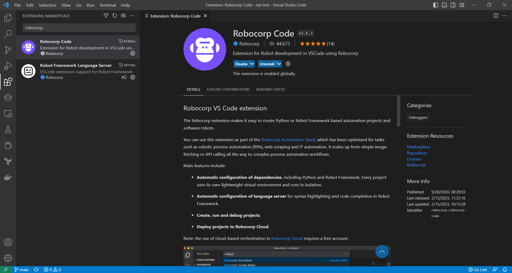
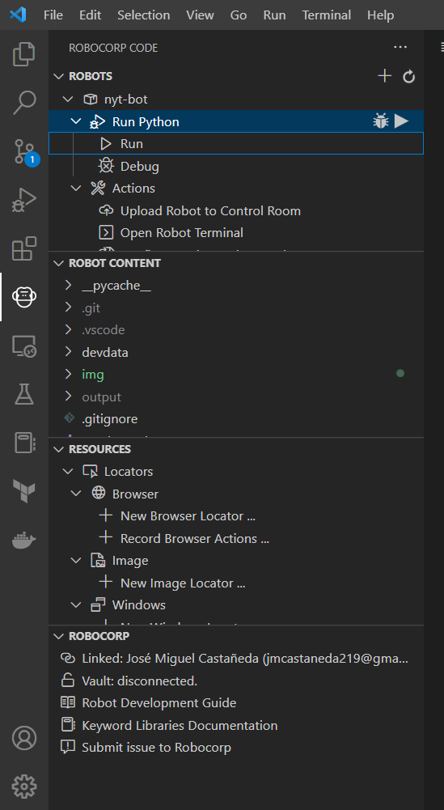
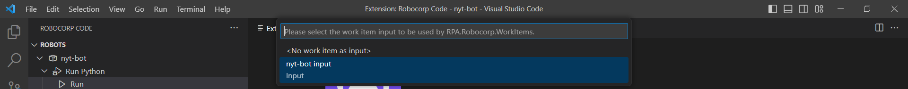

# NYT Robot

Bot para crear una base de datos a base de las búsquedas del sitio https://www.nytimes.com/

Para cambiar los filtros y la búsqueda que se harán en el sitio se tiene que cambiar el input del bot en el archivo [a link](https://github.com/Miguel219/nyt-bot/blob/main/devdata/work-items-in/nyt-bot%20input/work-items.json):

```
"payload": {
      "term": "money",
      "section": "U.S.",
      "months_number": 0,
      "output_excel": "output/data.xlsx",
      "output_pictures": "output"
    }
```

Para ejecutar el proyecto se debe de utilizar la extensión de Robocorp Code:


Presionar el botón de run dentro de la extensión de Robocorp Code:


Seleccionar el input "nyt-bot input":

